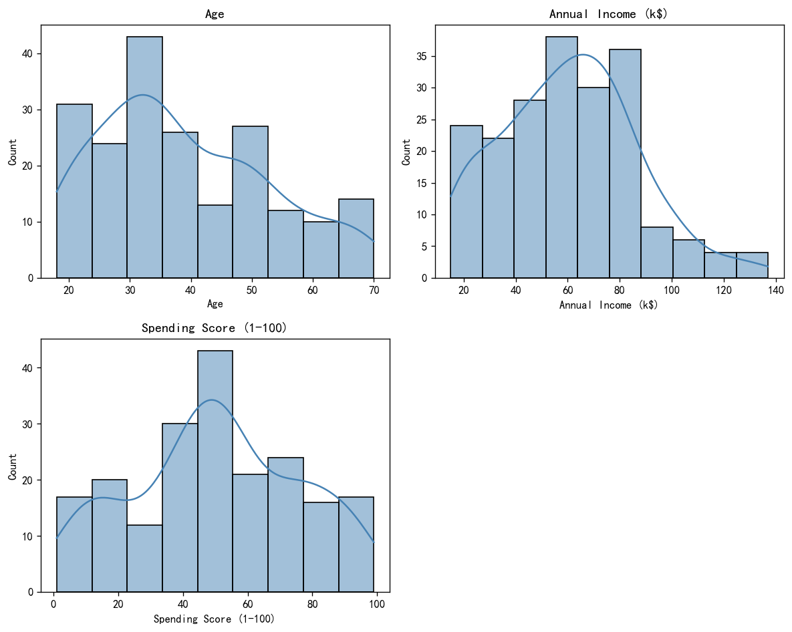
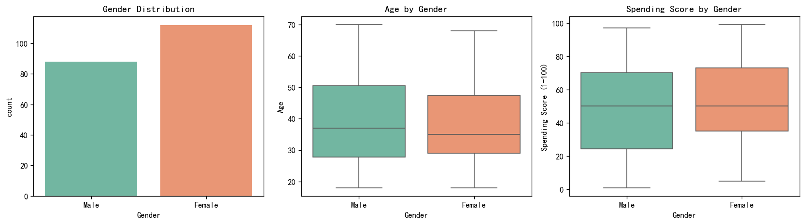
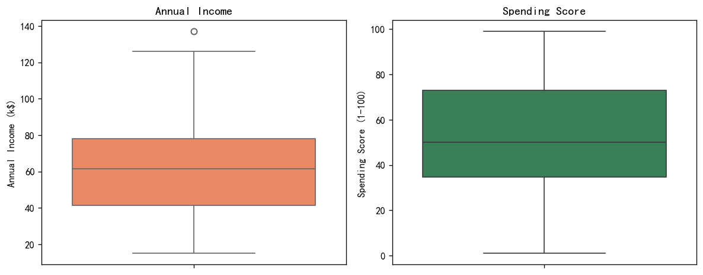
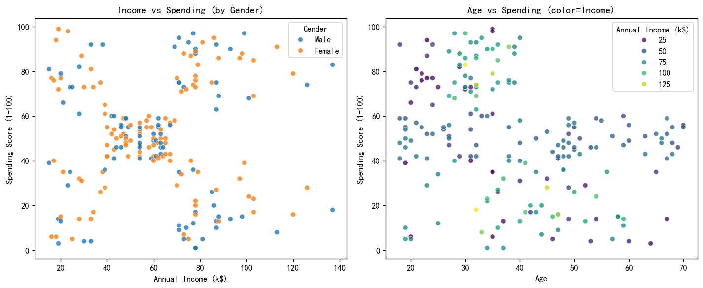
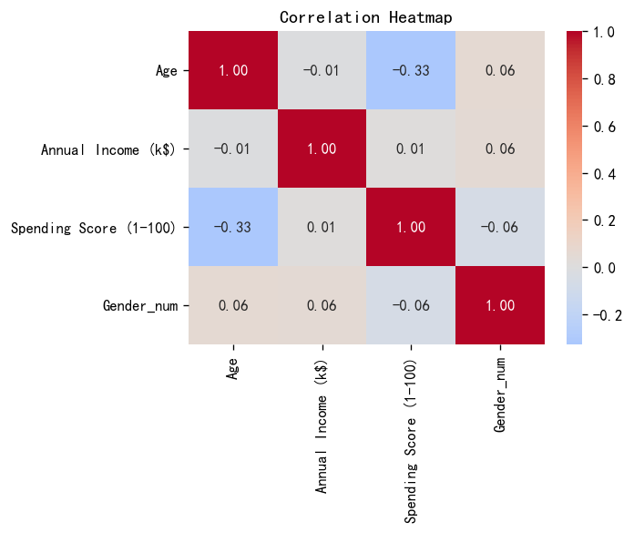
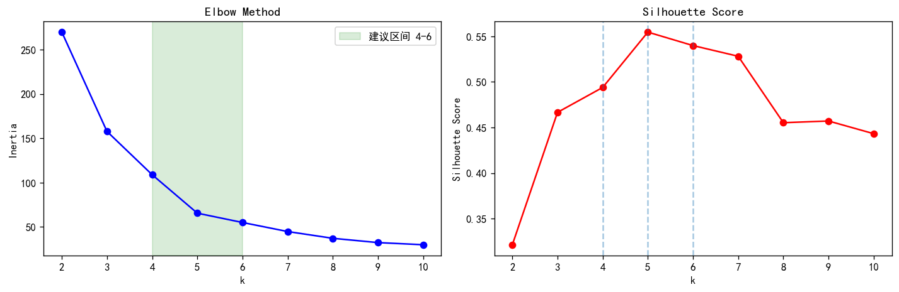
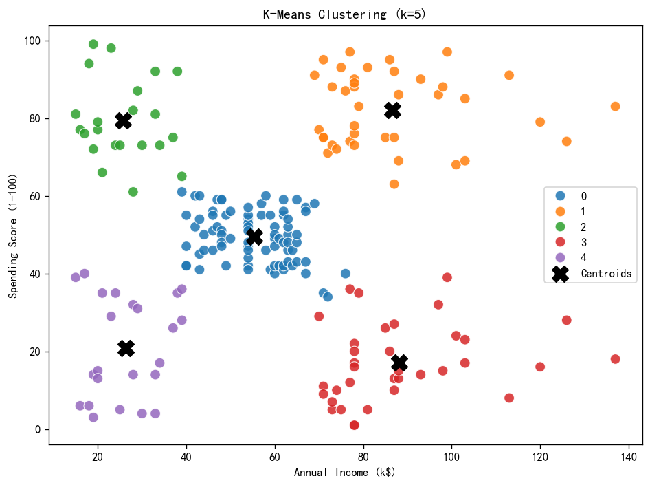
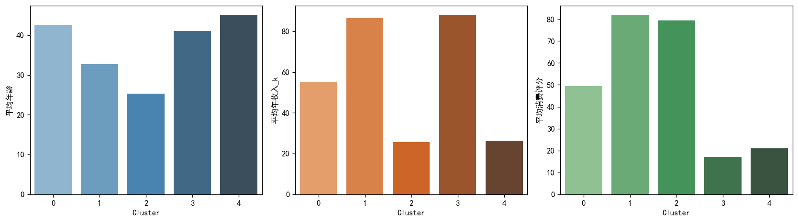

# 中国海洋大学工程实训

# 机器学习课程 · Week2 作业报告

## 商场客户聚类分析与营销策略

---

| 项目 | 内容 |
|------|------|
| **数据集** | Mall_Customers.csv |
| **工具** | Python、Pandas、Matplotlib/Seaborn、Scikit-learn |
| **姓名** | （请填写） |
| **学号** | （请填写） |
| **完成日期** | 2026 年 5 月 |

---

## 一、作业目的

利用商场客户数据，通过**探索性数据分析（EDA）**与 **K-Means 聚类**将客户划分为若干具有业务含义的群体，进而完成**客户画像**与**差异化营销策略**设计。本报告对应作业要求的五项任务：数据探索、特征选择与聚类、分群画像、营销建议及总结，代码与图表存放于 `week2/` 目录。

---

## 二、数据探索（任务 1）

### 2.1 数据加载与规模

| 项目 | 结果 |
|------|------|
| 样本量 | 200 条 |
| 字段数 | 5 列 |
| 文件 | `Mall_Customers.csv` |

| 字段名 | 含义 | 类型 |
|--------|------|------|
| CustomerID | 客户编号 | 整数 |
| Gender | 性别（Male/Female） | 分类 |
| Age | 年龄 | 数值 |
| Annual Income (k$) | 年收入（千美元） | 数值 |
| Spending Score (1-100) | 消费评分（1–100） | 数值 |

### 2.2 缺失值与异常值

- **缺失值**：各字段均为 0，数据完整，无需插补。  
- **异常值（IQR 法）**：`Age` 无异常；`Spending Score` 无异常；`Annual Income` 检出 **2 条**离群点（高端收入客户），属真实业务现象，聚类时保留。

### 2.3 描述统计摘要

| 变量 | 均值 | 标准差 | 最小 | 最大 |
|------|------|--------|------|------|
| Age | 38.9 | 13.9 | 18 | 70 |
| Annual Income (k$) | 60.6 | 26.3 | 15 | 137 |
| Spending Score | 50.2 | 25.8 | 1 | 99 |

- **性别**：Female 112 人（56%），Male 88 人（44%），略偏女性。  
- **收入与消费评分**：整体呈较分散分布，为后续二维聚类提供区分度。

### 2.4 可视化（EDA）

**图 1** 年龄、年收入、消费评分分布（左：年龄近正态；收入右偏；消费评分较均匀）。

**图 2** 性别比例及按性别划分的年龄、消费评分箱线图。

**图 3** 年收入与消费评分箱线图，可见收入与消费离散程度较大。

**图 4** 年收入—消费评分散点图显示客户自然形成多团块，适合聚类；性别在两维度上差异不极端。

**图 5** 年龄与消费评分略负相关（-0.33），收入与消费评分相关性弱，故聚类以**收入 + 消费评分**为主特征合理。

---

## 三、特征选择与聚类过程（任务 2）

### 3.1 特征选择

依据作业要求，选取二维关键特征：

- **Annual Income (k$)**：购买力  
- **Spending Score (1-100)**：消费意愿与活跃度  

聚类前对两特征进行 **StandardScaler** 标准化，消除量纲影响。

### 3.2 确定聚类数：手肘法 + 轮廓系数

| k | 惯性 (Inertia) | 轮廓系数 (Silhouette) |
|---|----------------|------------------------|
| 4 | 108.92 | 0.494 |
| **5** | **65.57** | **0.555** |
| 6 | 55.06 | 0.540 |

**图 6** 左图：k 从 4 增至 5 时惯性下降明显（“肘部”）；右图：在作业建议的 **k=4～6** 区间内，**k=5 轮廓系数最高（0.555）**，故选定 **5 类**。

### 3.3 K-Means 建模与标签

- 算法：`KMeans(n_clusters=5, random_state=42, n_init=10)`  
- 为每条客户打上标签 `Cluster`：0、1、2、3、4  
- 带标签数据：`output/Mall_Customers_clustered.csv`

**图 7** 五类客户在「收入—消费」平面上呈典型五象限分布，黑色 X 为簇中心。

---

## 四、客户分群画像（任务 3）

### 4.1 各群统计指标

| 客群 | 人数 | 平均年龄 | 平均年收入 (k$) | 平均消费评分 | 男性% | 女性% |
|:----:|:----:|:--------:|:---------------:|:------------:|:-----:|:-----:|
| 0 | 81 | 42.7 | 55.3 | 49.5 | 40.7 | 59.3 |
| 1 | 39 | 32.7 | 86.5 | 82.1 | 46.2 | 53.8 |
| 2 | 22 | 25.3 | 25.7 | 79.4 | 40.9 | 59.1 |
| 3 | 35 | 41.1 | 88.2 | 17.1 | 54.3 | 45.7 |
| 4 | 23 | 45.2 | 26.3 | 20.9 | 39.1 | 60.9 |

### 4.2 文字画像（是谁、特点、消费行为）

#### 客群 0 — 中等稳健型（81 人，占比最大）

- **是谁**：年龄约 43 岁，收入与消费均接近全样本中等水平，女性略多。  
- **特点**：消费习惯稳定，既不极端节俭也不冲动高消费。  
- **消费行为**：常规到店、理性选购，对会员积分与组合优惠有响应，是商场**基本盘**。

#### 客群 1 — 富裕积极型（39 人）

- **是谁**：平均年龄 33 岁，**高收入（86.5k$）、高消费评分（82.1）**。  
- **特点**：年轻高净值、消费意愿强。  
- **消费行为**：偏好品质与体验，对新品、联名、VIP 服务敏感，**客单价与复购潜力最高**。

#### 客群 2 — 潜力活跃型（22 人）

- **是谁**：平均年龄 **25 岁**，收入低（25.7k$）但消费评分高（79.4）。  
- **特点**：典型“低收入高花费”年轻人。  
- **消费行为**：冲动消费、社交驱动，对折扣、快闪、积分活动敏感。

#### 客群 3 — 富裕谨慎型（35 人）

- **是谁**：平均年龄 41 岁，**收入最高（88.2k$）但消费评分最低（17.1）**。  
- **特点**：购买力强但消费克制，理性、注重性价比或品牌信任。  
- **消费行为**：到店频率可能不低，但单笔消费谨慎，需**权益与信任**激活。

#### 客群 4 — 普通节约型（23 人）

- **是谁**：平均年龄 45 岁，低收入（26.3k$）、低消费（20.9）。  
- **特点**：价格敏感、注重实用。  
- **消费行为**：促销日、基础款、便民服务更能吸引到店。

---

## 五、营销策略（任务 4）

### 客群 0 — 中等稳健型

| 项目 | 内容 |
|------|------|
| **定位** | 中等收入、中等消费的稳定客群 |
| **建议 1** | 分级会员礼遇 + 生日月双倍积分 |
| **理由 1** | 习惯稳定，持续积分与等级权益可提升复购。 |
| **建议 2** | 家居、服饰等生活品类跨柜组合优惠 |
| **理由 2** | 客单价适中，组合促销可提高单次消费件数。 |

### 客群 1 — 富裕积极型

| 项目 | 内容 |
|------|------|
| **定位** | 高净值高消费核心客群 |
| **建议 1** | VIP 私人导购与新品预览会 |
| **理由 1** | 重视尊贵体验，专属服务提升客单价与粘性。 |
| **建议 2** | 奢侈/轻奢品牌限定联名 |
| **理由 2** | 高消费意愿匹配高端联名，强化认同。 |

### 客群 2 — 潜力活跃型

| 项目 | 内容 |
|------|------|
| **定位** | 年轻高活跃、价格敏感型 |
| **建议 1** | 会员积分翻倍 + 快闪/网红打卡 |
| **理由 1** | 收入有限但爱消费，社交与积分驱动到店。 |
| **建议 2** | 学生活动日、第二件半价 |
| **理由 2** | 对折扣响应强，短期促销拉客流。 |

### 客群 3 — 富裕谨慎型

| 项目 | 内容 |
|------|------|
| **定位** | 高收入低消费的理性客群 |
| **建议 1** | 高额满减券（满额可用）+ 保价承诺 |
| **理由 1** | 降低决策顾虑，撬动沉睡购买力。 |
| **建议 2** | 家庭套装 / 品质生活馆场景陈列 |
| **理由 2** | 强调实用与品质，提高连带率。 |

### 客群 4 — 普通节约型

| 项目 | 内容 |
|------|------|
| **定位** | 大众基础消费客群 |
| **建议 1** | 每周特价日 + 基础款组合包 |
| **理由 1** | 价格导向，明码低价最易转化。 |
| **建议 2** | 免费停车/接驳 + 社区便民服务 |
| **理由 2** | 低成本权益培养习惯性到店。 |

---

## 六、总结（任务 5）

1. **数据质量**：200 条客户记录完整无缺失，收入与消费评分分布适合聚类；收入存在少量高端离群点，属正常结构。  
2. **聚类结论**：在年收入与消费评分二维空间上，**K-Means（k=5）** 轮廓系数在建议区间内最优，将客户划分为中等稳健、富裕积极、潜力活跃、富裕谨慎、普通节约五类，与经典商场客户细分理论一致。  
3. **业务价值**：最大群体为**客群 0（中等稳健，81 人）**，应通过会员运营稳住基本盘；**客群 1** 贡献高端消费，**客群 2** 代表年轻增量，**客群 3** 需激活高净值低消费客户，**客群 4** 靠促销与便利引流。  
4. **局限与展望**：未纳入年龄、性别进入聚类特征；可尝试 DBSCAN、层次聚类对比；营销效果需 A/B 测试验证。

---

## 七、提交材料清单

| 文件 | 说明 |
|------|------|
| `工程实训作业报告_week2.md` / PDF | 本报告 |
| `mall_customer_clustering.ipynb` | Jupyter 代码 |
| `run_analysis.py` | 一键运行脚本 |
| `Mall_Customers.csv` | 原始数据 |
| `output/Mall_Customers_clustered.csv` | 带 Cluster 标签数据 |
| `output/cluster_profiles.csv` | 分群统计表 |
| `output/marketing_strategies.csv` | 营销策略表 |
| `figures/*.png` | 全部图表 |

---

## 参考文献

1. Kaggle: Mall Customer Segmentation Data.  
2. MacQueen, J. (1967). Some methods for classification and analysis of multivariate observations.  
3. Rousseeuw, P. J. (1987). Silhouettes: a graphical aid to cluster analysis.

---

*报告依据 `week2/run_analysis.py` 运行结果撰写，选定聚类数 k=5。*
