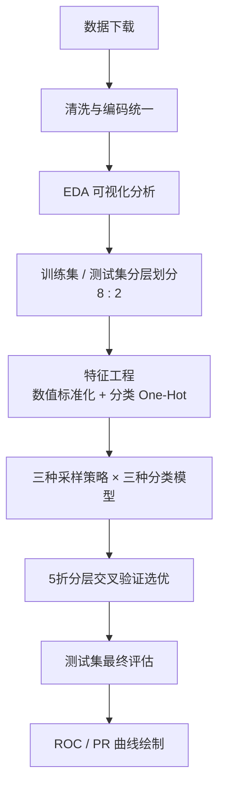

# 中国海洋大学工程实训

# 机器学习课程作业报告

## 基于 Kaggle 数据集的信用卡违约预测分析

---

| 项目 | 内容 |
|------|------|
| **课程** | 工程实训 · 机器学习 |
| **题目** | 信用卡客户违约预测（Default of Credit Card Clients） |
| **姓名** | 刘静洹 |
| **学号** | 22090032021 |
| **专业班级** | 计算机科学与技术2班 |
| **完成日期** | 2026 年 5 月 |

---

## 摘要

本报告以 Kaggle/UCI 公开的**台湾信用卡客户违约数据集**为研究对象，完成从数据获取、探索性分析、特征工程、不平衡处理到多模型对比的完整机器学习流程。数据集共 30,000 条样本、24 个特征，目标为预测客户下一月是否违约，属于典型的**类别不平衡二分类**问题。

实验采用逻辑回归、随机森林与支持向量机三种分类器，并分别结合原始数据、SMOTE 过采样与随机欠采样进行对比。经 5 折分层交叉验证，**支持向量机（SVM）+ SMOTE** 在 F1 与 ROC-AUC 综合表现最优；在独立测试集上，违约类 F1 为 0.526，Recall 为 0.550，ROC-AUC 为 0.753。结果表明：在不平衡场景下，不能仅依赖 Accuracy；通过重采样可显著提升对违约客户的识别能力，对银行风控具有实际参考价值。

**关键词**：信用卡违约预测；类别不平衡；SMOTE；支持向量机；F1-score；ROC-AUC

---

## 一、研究背景与目标

### 1.1 研究背景

信用卡业务中，客户违约会给金融机构带来信用风险与资金损失。如何在大量正常还款客户中及早识别可能违约的少数客户，是银行风控系统的核心需求之一。该问题在机器学习上表现为：样本量大、特征维度适中、**正负样本比例悬殊**（正常客户远多于违约客户）。

台湾学者 Yeh 与 Lien 于 2009 年发表的研究对多种数据挖掘方法在该数据集上的违约概率预测精度进行了系统比较，该数据集随后被 UCI 机器学习库收录，并在 Kaggle 平台广泛传播，成为分类与不平衡学习领域的经典教学案例。

### 1.2 研究目标

1. 理解数据集结构与变量含义，完成数据清洗与探索性分析（EDA）。
2. 构建可复现的机器学习流水线（预处理 + 采样 + 建模 + 评估）。
3. 比较不同模型及采样策略对违约预测性能的影响。
4. 以 **F1-score、Recall、ROC-AUC、PR-AUC** 为主要评价指标，形成可写入实训报告的分析结论。

---

## 二、数据集说明

### 2.1 数据来源

| 项目 | 说明 |
|------|------|
| 数据集名称 | Default of Credit Card Clients |
| 主要来源 | [Kaggle - UCI ML Repository](https://www.kaggle.com/datasets/uciml/default-of-credit-card-clients-dataset) |
| 本实验获取方式 | UCI 官方镜像自动下载（与 Kaggle 版本字段一致） |
| 本地文件 | `week1/UCI_Credit_Card.csv` |

### 2.2 数据规模与任务定义

- **样本量**：30,000 条  
- **特征数**：23 个预测特征 + 1 个目标变量（清洗后删除无意义 `ID`）  
- **任务类型**：二分类  
- **目标变量**：`default.payment.next.month`（0 = 未违约，1 = 违约）

### 2.3 特征分类

| 类别 | 变量示例 | 含义 |
|------|----------|------|
| 客户基本信息 | `LIMIT_BAL`, `SEX`, `EDUCATION`, `MARRIAGE`, `AGE` | 信用额度、性别、教育、婚姻、年龄 |
| 还款状态 | `PAY_0` ~ `PAY_6` | 近 6 个月还款状态（逾期月数等编码） |
| 账单金额 | `BILL_AMT1` ~ `BILL_AMT6` | 近 6 个月账单金额 |
| 还款金额 | `PAY_AMT1` ~ `PAY_AMT6` | 近 6 个月实际还款金额 |

### 2.4 类别分布（不平衡性）

| 类别 | 样本数 | 占比 |
|------|--------|------|
| 0（未违约） | 23,364 | 77.88% |
| 1（违约） | 6,636 | 22.12% |

违约样本约占五分之一，属于**中度类别不平衡**。若仅使用 Accuracy 评价，模型可能通过“全部预测为未违约”获得约 78% 的准确率，却无法识别真正的违约客户，因此在风控场景下必须关注 Recall、F1 与 AUC 等指标。

---

## 三、研究方法

### 3.1 技术路线

### 3.2 数据预处理

1. **删除**无预测意义的 `ID` 列。  
2. **编码修正**：将 `EDUCATION` 中 0、5、6 合并为“其他”（4）；将 `MARRIAGE` 中 0 合并为“其他”（3）。  
3. **缺失值**：经检查数据集无缺失值。  
4. **特征工程**：  
   - 数值特征：中位数填充 + `StandardScaler` 标准化；  
   - 分类特征（`SEX`, `EDUCATION`, `MARRIAGE`）：众数填充 + `OneHotEncoder`。  
5. **数据划分**：`train_test_split(stratify=y, test_size=0.2, random_state=42)`，保证训练集与测试集类别比例一致。

### 3.3 类别不平衡处理

| 策略 | 方法 | 作用 |
|------|------|------|
| 基线 | 不采样 | 反映原始分布下的模型表现 |
| 过采样 | SMOTE | 合成少数类样本，提升违约类学习机会 |
| 欠采样 | RandomUnderSampler | 减少多数类样本，平衡类别比例 |

采样步骤置于 `imblearn` 流水线中，**仅在训练折内拟合**，避免信息泄漏。

### 3.4 模型选择

| 模型 | 特点 | 参数设置 |
|------|------|----------|
| 逻辑回归 | 可解释性强，适合基线 | `max_iter=2000` |
| 随机森林 | 可捕捉非线性、特征交互 | `n_estimators=300` |
| 支持向量机（SVM） | 适合中小规模结构化数据 | `kernel=rbf`, `probability=True` |

### 3.5 评价指标

- **Accuracy**：整体正确率（参考，非主指标）  
- **Precision / Recall / F1**：关注违约类（正类）识别能力  
- **ROC-AUC**：衡量排序与区分能力  
- **PR-AUC**：在不平衡数据上对正类更敏感  

采用 **5 折分层交叉验证（StratifiedKFold）** 对 9 种「模型 × 采样」组合进行网格式对比，按交叉验证 **F1 与 ROC-AUC** 排序选取最优方案，再在 20% _hold-out_ 测试集上报告最终结果。

### 3.6 实验环境

| 项目 | 版本/说明 |
|------|-----------|
| Python | 3.11（Conda 环境 `ml`） |
| 主要库 | pandas, scikit-learn, imbalanced-learn, matplotlib, seaborn |
| 代码位置 | `week1/credit_card_default_kaggle_analysis.ipynb`、`week1/run_analysis.py` |

---

## 四、探索性数据分析

### 4.1 目标变量分布

**图 1** 左图显示未违约（0）样本明显多于违约（1）；右图为 `LIMIT_BAL` 分布，呈右偏，多数客户信用额度集中在较低区间，高额客户较少。

### 4.2 特征相关性

**图 2** 展示了与目标变量相关性较强的若干特征之间的相关结构。还款状态类变量（如 `PAY_0`）及历史账单、还款金额与违约行为存在较明显关联，为后续建模提供了依据。

---

## 五、实验结果

### 5.1 交叉验证对比（5 折平均）

| 排名 | 模型 | 采样策略 | Accuracy | Precision | Recall | **F1** | **ROC-AUC** |
|:----:|------|----------|----------|-----------|--------|--------|-------------|
| 1 | SVM | SMOTE | 0.780 | 0.502 | 0.575 | **0.536** | 0.759 |
| 2 | SVM | 欠采样 | 0.770 | 0.484 | 0.591 | 0.532 | 0.758 |
| 3 | 随机森林 | 欠采样 | 0.742 | 0.443 | 0.638 | 0.523 | **0.772** |
| 4 | 随机森林 | SMOTE | 0.800 | 0.556 | 0.473 | 0.511 | 0.763 |
| 5 | 逻辑回归 | 欠采样 | 0.689 | 0.381 | 0.647 | 0.479 | 0.727 |
| 6 | 随机森林 | 无采样 | 0.818 | 0.653 | 0.377 | 0.478 | 0.770 |
| 7 | 逻辑回归 | SMOTE | 0.682 | 0.375 | 0.657 | 0.477 | 0.729 |
| 8 | SVM | 无采样 | 0.820 | 0.685 | 0.342 | 0.456 | 0.723 |
| 9 | 逻辑回归 | 无采样 | 0.811 | 0.711 | 0.246 | 0.365 | 0.727 |

> 完整数值见 `model_comparison.csv`。

**主要观察：**

1. **无采样时**三种模型 F1 均偏低（0.37~0.48），逻辑回归 Recall 仅 0.246，说明模型倾向于预测“不违约”。  
2. **引入 SMOTE 或欠采样后**，F1 普遍提升约 0.10~0.17，Recall 显著提高。  
3. **SVM + SMOTE** 取得最高 F1（0.536）；**随机森林 + 欠采样** ROC-AUC 最高（0.772），但 F1 略低于最优 SVM 方案。

### 5.2 最优模型测试集表现（SVM + SMOTE）

| 类别 | Precision | Recall | F1-score | 支持数 |
|------|-----------|--------|----------|--------|
| 0（未违约） | 0.869 | 0.847 | 0.858 | 4,673 |
| 1（违约） | 0.505 | 0.550 | **0.526** | 1,327 |
| **整体** | — | — | Accuracy **0.781** | 6,000 |

| 综合指标 | 数值 |
|----------|------|
| ROC-AUC | **0.753** |
| PR-AUC | **0.491** |

### 5.3 混淆矩阵与 ROC/PR 曲线

**图 3** 混淆矩阵显示：测试集 6,000 条样本中，模型正确识别多数未违约客户，对违约客户存在一定误报与漏报，但整体 Recall 达到 0.55，优于无采样基线。

**图 4** 左为 ROC 曲线（AUC ≈ 0.753），右为 PR 曲线（AUC ≈ 0.491）。ROC 表现尚可；PR-AUC 受不平衡影响相对较低，说明在“高精确率”要求下仍有优化空间。

---

## 六、结果分析与讨论

### 6.1 类别不平衡对评价指标的影响

无采样时，逻辑回归 Accuracy 达 0.811，但违约类 F1 仅 0.365。这是因为模型将大量样本判为“未违约”即可在 Accuracy 上获得高分，却牺牲了少数类识别能力。**风控业务更关注能否“抓出”潜在违约客户**，因此 Recall 与 F1 更具实际意义。

### 6.2 采样策略的作用

- **SMOTE**：通过合成少数类样本，使 SVM、逻辑回归在决策边界学习上更关注违约区域，SVM+SMOTE 的 F1 达到最优。  
- **欠采样**：随机森林配合欠采样时 Recall 最高（0.638），但 Accuracy 与 Precision 有所下降，存在“宁可错杀、不可放过”的倾向。  
- 实际业务中需在**漏报成本**（放过违约客户）与**误报成本**（误判正常客户）之间权衡，从而选择过采样或欠采样策略。

### 6.3 模型特性比较

| 模型 | 优势 | 本实验表现 |
|------|------|------------|
| 逻辑回归 | 系数可解释，部署简单 | 适合基线；采样后 Recall 提升明显，但综合 F1 仍最低 |
| 随机森林 | 非线性拟合、特征重要性 | ROC-AUC 表现突出，适合进一步做特征筛选与调参 |
| SVM | 高维边界、中小样本表现稳定 | 配合 SMOTE 后 F1 最优，作为本实验推荐方案 |

### 6.4 局限与改进方向

1. **超参数**未做系统网格搜索，SVM、随机森林仍有提升空间。  
2. **特征工程**可进一步构造逾期次数、还款率等衍生变量。  
3. 可尝试 **XGBoost / LightGBM** 及 **代价敏感学习**（`class_weight`）与采样方法对比。  
4. 风控场景可结合**业务阈值调整**，在 PR 曲线上选取符合银行风险偏好的工作点。

---

## 七、结论

本实训基于 Kaggle/UCI 信用卡违约数据集，完成了规范的机器学习分析全流程，主要结论如下：

1. 数据集存在约 **4:1** 的类别不平衡，必须以 F1、Recall、AUC 等指标评价，不能依赖 Accuracy  alone。  
2. **SMOTE 与随机欠采样**均能显著改善对违约客户的识别，交叉验证 F1 较无采样基线提升约 **10~17 个百分点**。  
3. 综合交叉验证与测试集表现，**SVM + SMOTE** 为本次实验最优组合（测试集违约类 F1=0.526，ROC-AUC=0.753）。  
4. 从业务角度，该模型可在“预警—人工复核”流程中辅助筛查高风险客户；若要投入生产，还需结合合规要求、样本漂移监测与持续再训练。

---

## 八、参考文献

1. Yeh, I. C., & Lien, C. H. (2009). The comparisons of data mining techniques for the predictive accuracy of probability of default of credit card clients. *Expert Systems with Applications*, 36(2), 2473-2480.  
2. UCI Machine Learning Repository: Default of Credit Card Clients. https://archive.ics.uci.edu/dataset/350/default+of+credit+card+clients  
3. Kaggle Dataset: Default of Credit Card Clients. https://www.kaggle.com/datasets/uciml/default-of-credit-card-clients-dataset  
4. Chawla, N. V., et al. (2002). SMOTE: Synthetic Minority Over-sampling Technique. *Journal of Artificial Intelligence Research*, 16, 321-357.

---

## 九、附录：提交材料清单

| 序号 | 文件路径 | 说明 |
|:----:|----------|------|
| 1 | `week1/工程实训作业报告.pdf` | 本报告 |
| 2 | `week1/credit_card_default_kaggle_analysis.ipynb` | Jupyter 分析源码 |
| 3 | `week1/run_analysis.py` | 可复现实验脚本 |
| 4 | `week1/download_data.py` | 数据下载脚本 |
| 5 | `week1/model_comparison.csv` | 模型对比结果表 |
| 6 | `week1/figures/*.png` | EDA 与评估图表（4 张） |
| 7 | `week1/UCI_Credit_Card.csv` | 实验数据集 |

